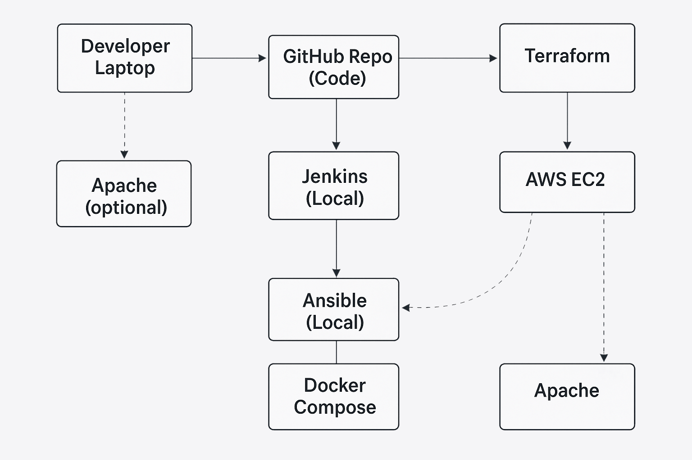

# 🧪 Flask Redis DevOps Project

This project demonstrates how to deploy a simple Flask app backed by Redis using modern DevOps tools: **Linux, Apache, Docker, Jenkins, Ansible, Terraform, and AWS**.

---

## 🗺️ Project Overview

**Goal**: Build and deploy a simple web app to AWS with full automation across the stack.

- Frontend: Flask (Python)
- Backend: Redis for counting page hits
- Web Server: Apache (mod_wsgi)
- Containerization: Docker & Docker Compose
- CI/CD: Jenkins with Ansible Playbook
- Infrastructure: AWS EC2 via Terraform

---

## 🛠️ Tech Stack

| Tool        | Purpose                            |
|-------------|-------------------------------------|
| Ubuntu      | Base OS                            |
| Python + Flask | Web framework                   |
| Redis       | Key-value store                    |
| Apache      | Production WSGI server             |
| Docker      | Containerization                   |
| Ansible     | Automation                         |
| Jenkins     | CI/CD pipeline                     |
| Terraform   | Infrastructure as Code             |
| AWS EC2     | Cloud hosting                      |

---

## 📸 Architecture Diagram



---

## 🚀 Quick Start

### 1. Clone the Repo
```bash
git clone https://github.com/your-username/flask-redis-devops.git
cd flask-redis-devops
```
### 2. Use Docker to run locally
```bash
cd app
docker-compose up --build
```
Visit: http://localhost:5000

## 🚀 Hosting Flask App with Apache2 + mod_wsgi

### 1. Move Flask app to Apache directory
```bash
sudo mv flask-redis-devops/app /var/www/flask-redis-app
cd /var/www/flask-redis-app
```
### 2. Install Apache and mod_wsgi
```bash
sudo apt update
sudo apt install -y apache2 libapache2-mod-wsgi-py3 python3-venv
```
### 3. Create a Python virtual environment
```bash
python3 -m venv venv
source venv/bin/activate
pip install -r requirements.txt
```
### 4. Move Apache config file
```bash
sudo mv flask-redis-devops/apache/flaskapp.conf /etc/apache2/sites-available/flaskapp.conf
```
### 5. Enable your site and restart Apache
```bash
sudo a2ensite flaskapp
sudo systemctl restart apache2
```
Visit: http://personal-ip

### ⚙️ Jenkins Setup

1. Install Jenkins on your VM or local machine.
2. Create a new **Pipeline project**.
3. In Pipeline config, set **Definition = Pipeline script from SCM**.
4. Set your repo URL and path to the `jenkins/Jenkinsfile`.

The pipeline will:

- Clone your repo
- Install Pip3 (if needed)
- Install Ansible (if needed)
- Install flask and redis (if needed)
- Run the playbook to deploy the app using Docker

## ☁️ Terraform

### 1. Configure AWS with Terraform
```bash
aws configure
```
### 2. Create an AWS EC2 instance
```bash
cd terraform
terraform init
terraform apply
```
